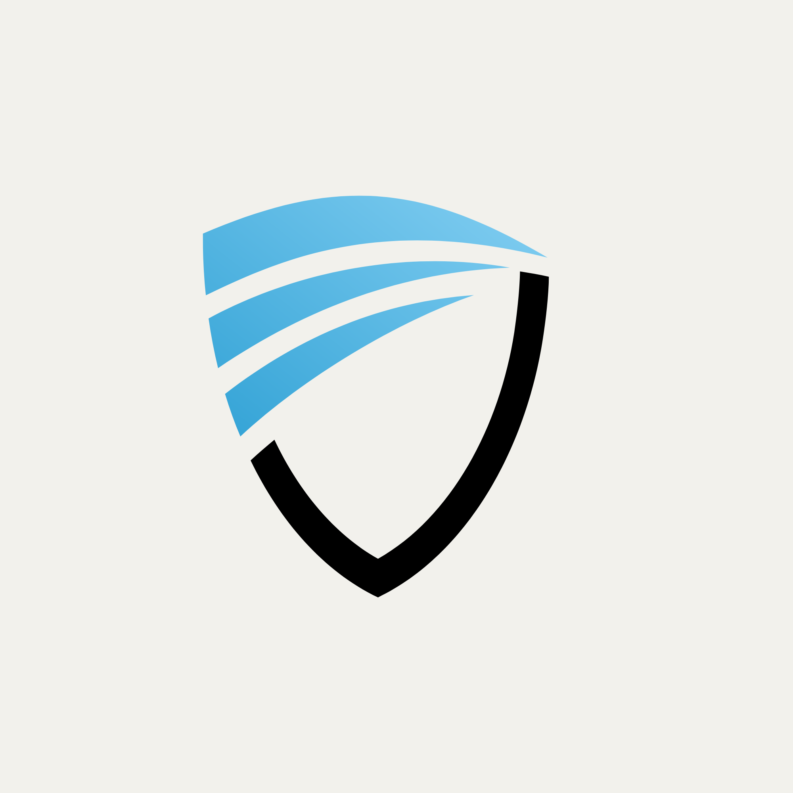

<p align="center">
  
</p>

# Veritas Microservices Platform

Veritas is a secure, multi-tenant enterprise examination platform built with a microservices architecture. It features Go-based business services, Python-based AI proctoring and grading services, and an event-driven core powered by Apache Kafka.

## Architecture Overview

Veritas utilizes a hybrid communication model designed for scale, isolation, and resiliency:

- **Synchronous HTTP APIs**: Used for request/response operations requiring immediate consistency (e.g., fetching exam configurations, validating auth tokens, and checks against the tenant/enterprise configuration).
- **Asynchronous Event-Driven Messaging**: Powered by **Apache Kafka** to propagate domain events (e.g., exam session starts, proctoring alerts, final results, billing updates, and enterprise suspensions) across decoupled service boundaries.
- **Shared Library Core (`shared/`)**: A centralized Go module containing common packages reused across Go services:
  - `caching`: Redis client wrappers and cache patterns.
  - `config`: Unified environment variable loading and validation.
  - `cronjob`: Managed background workers.
  - `httpclient`: Context-aware, tracing-friendly HTTP client wrappers.
  - `logger`: Structured JSON logging framework.
  - `messaging`: Kafka producer/consumer initialization and boilerplate.
  - `middleware`: Common Gin routers middleware (CORS, JWT Authentication, rate limiting).
  - `pagination`: Standardized paging parameter parsing and response formats.
  - `storage`: Media upload client wrapper (e.g., Cloudinary integration).

## System Design Figures

System design diagrams are available as markdown pages with embedded HTML figures:

- [System Architecture](docs/report/assets/system_designs/system_architecture.md)
- [Subsystems Decomposition](docs/report/assets/system_designs/subsystems_decomposition.md)
- [Deployment Diagram](docs/report/assets/system_designs/deployment_diagram.md)

## Core Services

### Go Services (Port 8080 internal)
- **API Gateway**: The reverse proxy and single-entry point for clients; handles request routing, authorization, and exposes centralized system documentation.
- **Authentication Service**: Manages user identity, session lifecycle, token signing, and role-based access control.
- **Enterprise Service**: Manages multi-tenant onboarding, billing state transitions, policy management, and enterprise administrative controls.
- **Exam Management Service**: Handles exam templates, question banks, layout configuration, and scheduling.
- **Candidate Management Service**: Manages candidate registrations, enrollment codes, and serves the candidate examination player interface.
- **Notification Service**: Listens to Kafka domain events to deliver transactional emails/notifications (e.g., registration invites, exam schedules, and test results).
- **Payment Service**: Integrates with payment providers to handle subscriptions and enterprise invoicing.

### Python Services (Port 8000 internal)
- **Proctoring Service**: A FastAPI service performing AI-driven behavioral monitoring, webcam face verification, and issuing real-time cheating suspicion scores.
- **Grading Service**: A machine learning scoring pipeline to automate grading of open-ended and complex exam responses.

## Accessing Services & Ports

A shared docker network exposes the services on the following host ports:

| Service | Local Host Port | Primary Purpose |
|---------|----------------|-----------------|
| **API Gateway** | `8080` | Client entrypoint & Unified Swagger UI |
| **Auth Service** | `8081` | Authentication & token endpoints |
| **Enterprise Service** | `8082` | Tenant/Enterprise onboarding and settings |
| **Exam Service** | `8083` | Exam definitions and schedules |
| **Candidate Service** | `8084` | Candidate enrollment and exam sessions |
| **Payment Service** | `8085` | Subscriptions and invoicing |
| **Proctoring Service** | `8086` | Real-time AI face proctoring |
| **Grading Service** | `8087` | Automated grading & scoring pipeline |
| **Notification Service**| `8090` | Transactional email & alerts |
| **pgAdmin** | `5050` | Web UI for Postgres database administration |
| **Redis** | `6379` | Cache & session database |
| **Kafka** | `9092` | Event broker backbone |
| **PostgreSQL** | `5432` | Shared database instance (multi-database schemas) |


## Getting Started

### Prerequisites
- [Docker](https://www.docker.com/) and **Docker Compose** installed.
- [Go (v1.21+)](https://go.dev/) (for local development outside Docker).
- [Python (v3.10+)](https://www.python.org/) (for AI/ML service development).

### 1. Bootstrapping Development Dependencies
To set up local environment variables, tidy Go modules, and create Python virtual environments with dependencies installed, run:

```bash
./scripts/setup_dev.sh
```

### 2. Running the Platform
To build and start all containers in the background:

```bash
docker compose up --build
```

To view live orchestrated logs:

```bash
./scripts/dev_logs.sh
```

## Databases & Migrations

Veritas employs a **database-per-service** architecture. While running on a shared Postgres instance (`port 5432`), each microservice has its own isolated database schema:
- `veritas_enterprise_db`
- `veritas_auth_db`
- `veritas_exam_db`
- `veritas_candidate_db`
- `veritas_payment_db`
- `veritas_proctoring_db`
- `veritas_grading_db`

### Running Migrations
Use the unified migrations tool from the root directory:

```bash
# Apply all UP migrations across Go & Python services sequentially
./scripts/migrate.sh up

# Roll back all migrations in reverse dependency order
./scripts/migrate.sh down

# Wipe and re-apply all migrations from scratch
./scripts/migrate.sh reset
```

## API Documentation

Each HTTP service contains code-first Swagger comments. 

### Generating Swagger Specs
To regenerate Swagger specifications for Go services:

```bash
# Regenerate for all Go services
./scripts/gen-swagger.sh all

# Regenerate for a specific service
./scripts/gen-swagger.sh exam-service
```
Once services are running, the interactive documentation is served through the API Gateway at `http://localhost:8080`.
