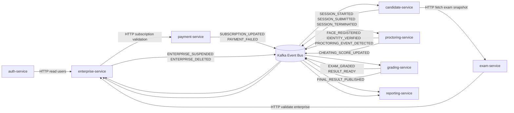

# Veritas System Architecture

## 1. Overview

Veritas is a microservices-based examination platform built around two communication styles:

- **Synchronous HTTP APIs** for strongly consistent request/response operations.
- **Asynchronous event-driven messaging** via **Kafka** for decoupled workflows and cross-domain reactions.

This hybrid approach supports independent service evolution, resilience under load, and near real-time propagation of critical exam lifecycle events.

## 2. Core Services

### Platform and business domain services

- **auth-service**: authentication, token management, identity/session boundary.
- **enterprise-service**: enterprise onboarding, tenant lifecycle, and policy/suspension controls.
- **exam-service**: exam definitions, validation, and snapshots.
- **candidate-service**: candidate exam session orchestration and lifecycle state transitions.
- **payment-service**: subscription and payment status management.

### AI/analytics and monitoring services

- **proctoring-service**: suspicious behavior detection, face verification (identity signals), and proctoring events.
- **grading-service**: scoring pipelines, grading completion, and final result publishing.
- **reporting-service**: aggregated operational/assessment reporting from event streams.

### Event backbone

- **Kafka Event Bus**: asynchronous integration backbone used for domain events, reactive workflows, and inter-service notifications.

## 3. Communication Model

### 3.1 Synchronous HTTP interactions

- `auth-service -> enterprise-service`: read user/tenant context.
- `exam-service -> enterprise-service`: validate enterprise status.
- `candidate-service -> exam-service`: fetch exam snapshot.
- `enterprise-service -> payment-service`: validate subscription state.

### 3.2 Event-driven interactions (Kafka)

Producers publish domain events to Kafka. Consumers subscribe to topics relevant to their bounded context. This pattern enables:

- eventual consistency across services,
- independent scaling of producers/consumers,
- reduced direct coupling between domains.

## 4. Event Flow Diagram

## 5. Key Event Categories

- **Session lifecycle**: `SESSION_STARTED`, `SESSION_SUBMITTED`, `SESSION_TERMINATED`.
- **Identity lifecycle**: `FACE_REGISTERED`, `IDENTITY_VERIFIED`.
- **Proctoring intelligence**: `PROCTORING_EVENT_DETECTED`, `CHEATING_SCORE_UPDATED`.
- **Assessment outcomes**: `EXAM_GRADED`, `RESULT_READY`, `FINAL_RESULT_PUBLISHED`.
- **Tenant/commercial state**: `SUBSCRIPTION_UPDATED`, `PAYMENT_FAILED`, `ENTERPRISE_SUSPENDED`, `ENTERPRISE_DELETED`.

## 6. Architectural Characteristics

- **Service autonomy**: each domain is isolated and independently deployable.
- **Scalable processing**: heavy/variable workloads are absorbed by Kafka consumers.
- **Fault tolerance**: event buffering reduces cascading failures in synchronous chains.
- **Extensibility**: new consumers can be added without changing event producers.

## 7. Operational Considerations

- Define topic-level contracts (schema versioning and backward compatibility).
- Ensure idempotent consumer logic and safe retries.
- Add distributed tracing and correlation IDs across HTTP + Kafka boundaries.
- Configure dead-letter topics and alerting for failed event processing.

