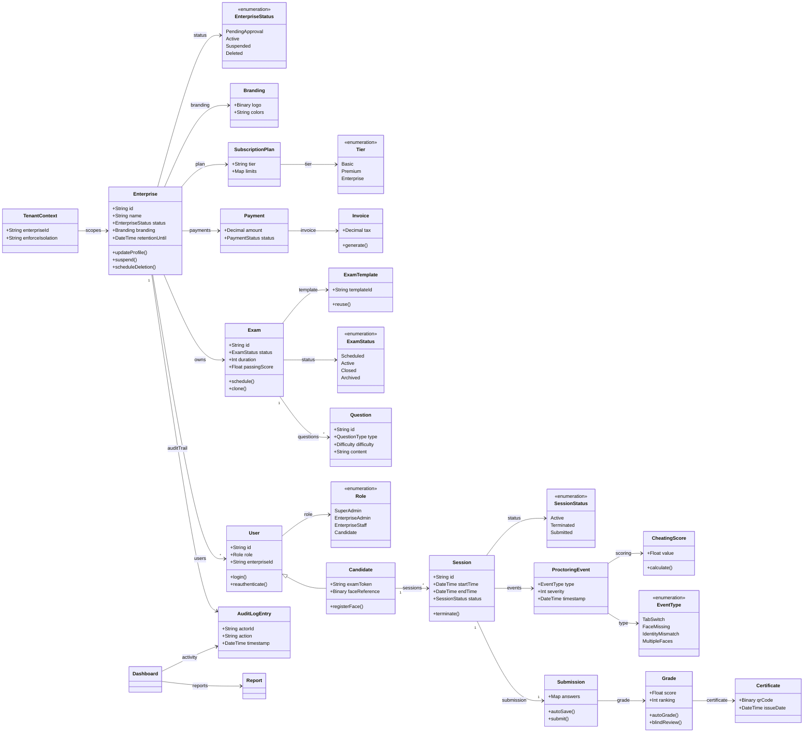

# Class Diagram

```mermaid
classDiagram
	direction LR

	class TenantContext {
		+String enterpriseId
		+String enforceIsolation
	}

	class EnterpriseStatus {
		<<enumeration>>
		PendingApproval
		Active
		Suspended
		Deleted
	}

	class Branding {
		+Binary logo
		+String colors
	}

	class Enterprise {
		+String id
		+String name
		+EnterpriseStatus status
		+Branding branding
		+DateTime retentionUntil
		+updateProfile()
		+suspend()
		+scheduleDeletion()
	}

	class SubscriptionPlan {
		+String tier
		+Map limits
	}

	class Tier {
		<<enumeration>>
		Basic
		Premium
		Enterprise
	}

	class Payment {
		+Decimal amount
		+PaymentStatus status
	}

	class Invoice {
		+Decimal tax
		+generate()
	}

	class Exam {
		+String id
		+ExamStatus status
		+Int duration
		+Float passingScore
		+schedule()
		+clone()
	}

	class ExamTemplate {
		+String templateId
		+reuse()
	}

	class ExamStatus {
		<<enumeration>>
		Scheduled
		Active
		Closed
		Archived
	}

	class Question {
		+String id
		+QuestionType type
		+Difficulty difficulty
		+String content
	}

	class User {
		+String id
		+Role role
		+String enterpriseId
		+login()
		+reauthenticate()
	}

	class Role {
		<<enumeration>>
		SuperAdmin
		EnterpriseAdmin
		EnterpriseStaff
		Candidate
	}

	class Candidate {
		+String examToken
		+Binary faceReference
		+registerFace()
	}

	class AuditLogEntry {
		+String actorId
		+String action
		+DateTime timestamp
	}

	class Dashboard
	class Report

	class Session {
		+String id
		+DateTime startTime
		+DateTime endTime
		+SessionStatus status
		+terminate()
	}

	class SessionStatus {
		<<enumeration>>
		Active
		Terminated
		Submitted
	}

	class Submission {
		+Map answers
		+autoSave()
		+submit()
	}

	class ProctoringEvent {
		+EventType type
		+Int severity
		+DateTime timestamp
	}

	class CheatingScore {
		+Float value
		+calculate()
	}

	class EventType {
		<<enumeration>>
		TabSwitch
		FaceMissing
		IdentityMismatch
		MultipleFaces
	}

	class Grade {
		+Float score
		+Int ranking
		+autoGrade()
		+blindReview()
	}

	class Certificate {
		+Binary qrCode
		+DateTime issueDate
	}

	%% Tenant & Enterprise Management
	TenantContext --> Enterprise : scopes
	Enterprise --> EnterpriseStatus : status
	Enterprise --> Branding : branding

	%% Billing & Subscription
	Enterprise --> SubscriptionPlan : plan
	SubscriptionPlan --> Tier : tier
	Enterprise --> Payment : payments
	Payment --> Invoice : invoice

	%% Exam Management
	Enterprise --> Exam : owns
	Exam --> ExamStatus : status
	Exam --> ExamTemplate : template
	Exam "1" --> "*" Question : questions

	%% Authentication & Users
	Enterprise "1" --> "*" User : users
	User --> Role : role
	User <|-- Candidate

	%% Dashboard & Reporting
	Enterprise --> AuditLogEntry : auditTrail
	Dashboard --> AuditLogEntry : activity
	Dashboard --> Report : reports

	%% Candidate Session
	Candidate "1" --> "*" Session : sessions
	Session --> SessionStatus : status
	Session "1" --> "1" Submission : submission

	%% AI Proctoring
	Session --> ProctoringEvent : events
	ProctoringEvent --> EventType : type
	ProctoringEvent --> CheatingScore : scoring

	%% Grading & Certification
	Submission --> Grade : grade
	Grade --> Certificate : certificate
```