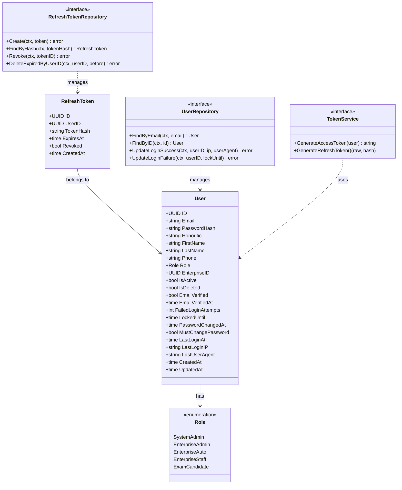
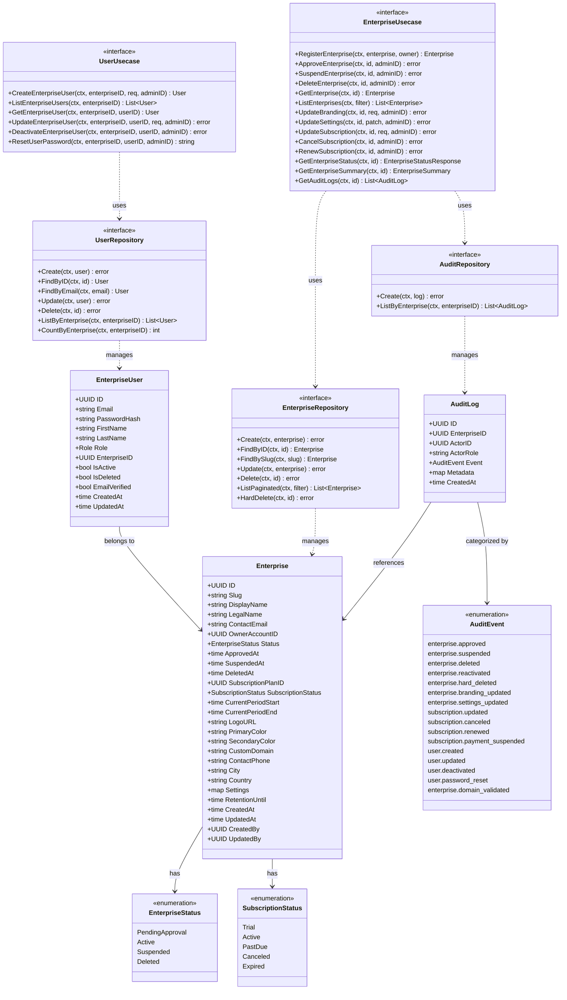
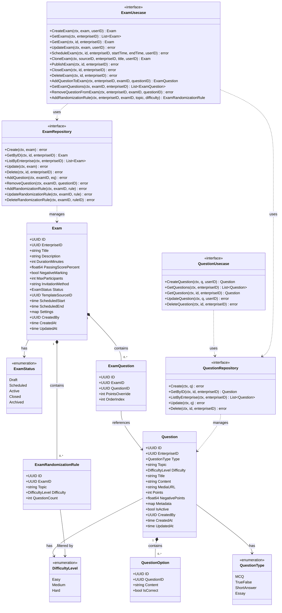
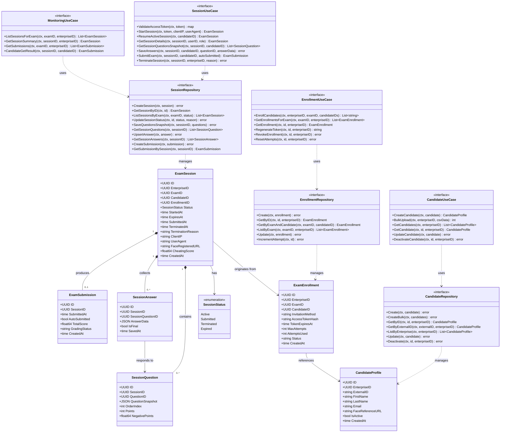
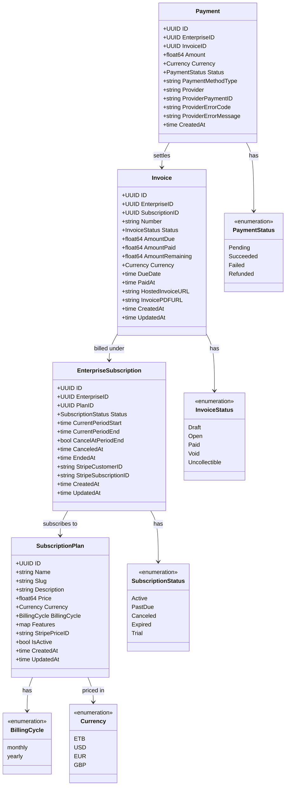
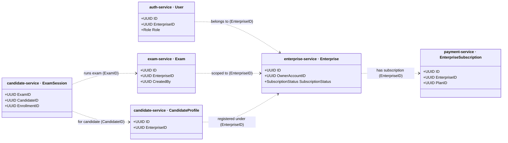

# Veritas — System Class Diagram

> System-level class diagram covering all five implemented Go microservices.  
> Interfaces (ports) are shown with `<<interface>>` stereotype; enumerations with `<<enumeration>>`.  
> Cross-service identity references (e.g. `enterprise_id`, `candidate_id`) are shown as dependency arrows rather than composition, since they cross service boundaries.

---

## Auth Service

---

## Enterprise Service

---

## Exam Service

---

## Candidate Service

---

## Payment Service

---

## Cross-Service Relationships

