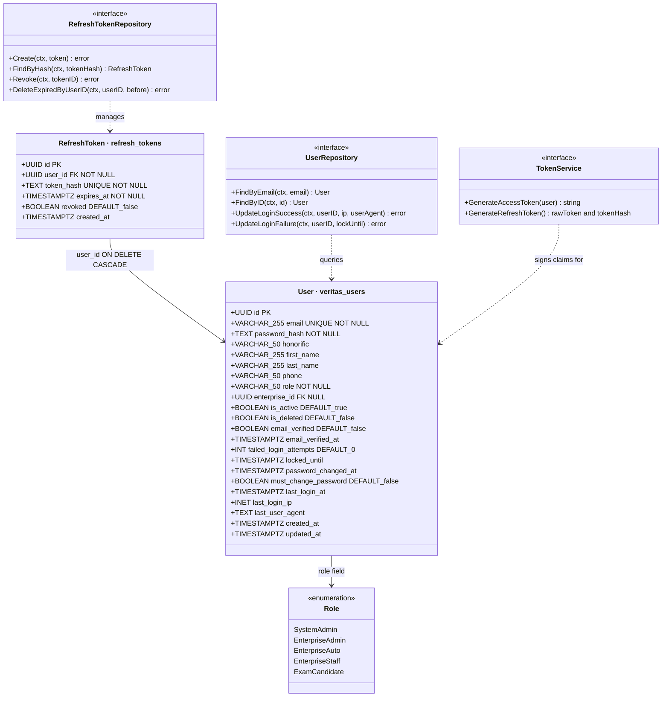
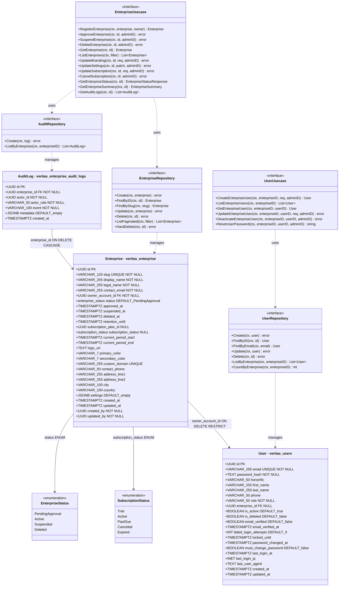
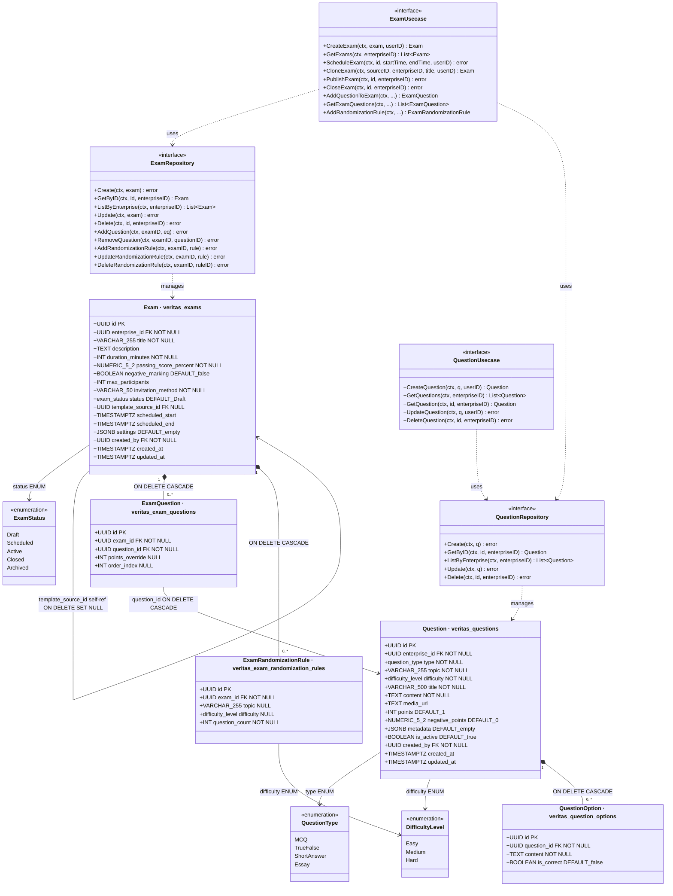
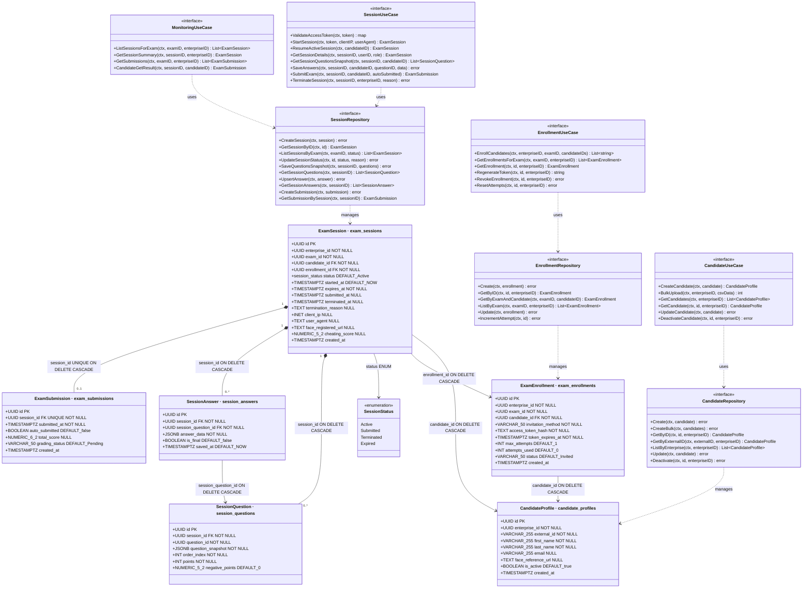
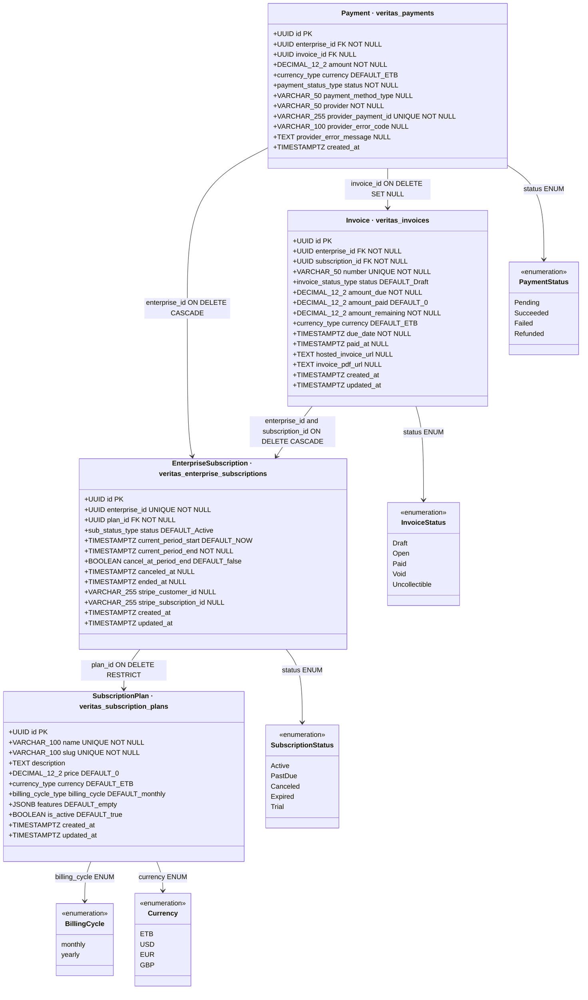
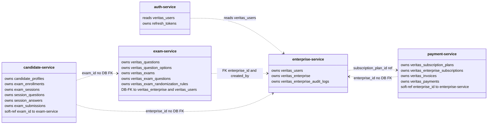

# Veritas — System Class Diagram

> Class diagram derived from both the Go domain models and the SQL migration files for each service.
> Table names (e.g. `veritas_users`) are shown in class titles.
> `<<interface>>` = Go port/usecase interface · `<<enumeration>>` = Go const block / SQL ENUM
> Cross-service FK references are annotated on arrows; they cross service boundaries and are not always enforced by DB FK in the consuming service.

---

## Auth Service

> `veritas_users` is **created** by the enterprise-service migration and **read** by the auth-service. The auth-service only owns `refresh_tokens`.

**Indexes:** `idx_refresh_tokens_user_id`, `idx_refresh_tokens_token_hash`
**FK:** `refresh_tokens.user_id` → `veritas_users(id)` ON DELETE CASCADE

---

## Enterprise Service

**Indexes:** `idx_enterprises_status`, `idx_enterprises_owner`, `idx_enterprises_subscription_status`,
`idx_enterprises_active` (partial WHERE Active), `idx_enterprises_subscription_expiry` (partial), `idx_enterprises_settings` (GIN),
`idx_veritas_users_email`, `idx_veritas_users_role`, `idx_veritas_users_enterprise_id` (partial)
**Constraint:** `chk_slug_format` — slug must match `^[a-z0-9-]+$`

---

## Exam Service

> Cross-service FKs to `veritas_enterprise` and `veritas_users` are enforced at the DB level in this service's migration.

**Unique constraint:** `(exam_id, question_id)` on `veritas_exam_questions`
**Indexes:** `idx_questions_enterprise`, `idx_exams_enterprise`, `idx_exams_status`, `idx_exam_schedule`,
`idx_question_options_question`, `idx_exam_questions_exam`, `idx_random_rules_exam`

---

## Candidate Service

**Unique constraints:** `(enterprise_id, external_id)` on `candidate_profiles`; `(exam_id, candidate_id)` on `exam_enrollments`;
`session_id` on `exam_submissions`; `(session_id, session_question_id)` on `session_answers`
**Indexes:** `idx_candidate_enterprise`, `idx_enrollment_exam`, `idx_enrollment_candidate`, `idx_enrollment_status`,
`idx_session_exam`, `idx_session_candidate`, `idx_session_enrollment`, `idx_session_status`,
`idx_sq_session`, `idx_answers_session`, `idx_submissions_session`

---

## Payment Service

**Unique constraints:** `enterprise_id` on `veritas_enterprise_subscriptions` (one per enterprise);
`provider_payment_id` on `veritas_payments`; `number` on `veritas_invoices`
**FK note:** `veritas_invoices.enterprise_id` references `veritas_enterprise_subscriptions(enterprise_id)`, not `veritas_enterprise(id)`
**Indexes:** `idx_subs_enterprise`, `idx_subs_status`, `idx_invoices_enterprise`, `idx_invoices_status`,
`idx_payments_enterprise`, `idx_payments_status`, `idx_plans_slug`

---

## Cross-Service Relationships

