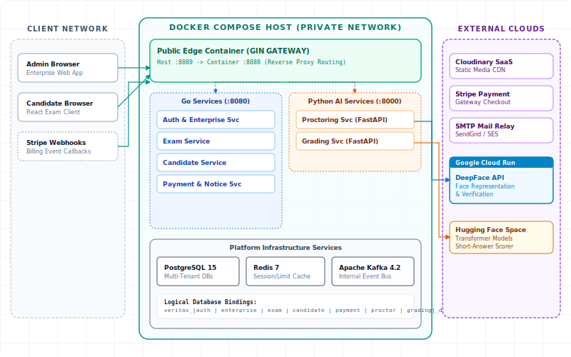

# Veritas Deployment Architecture

This document accompanies the standalone HTML deployment figure for the Veritas online assessment platform. The embedded view models the physical/runtime topology: client entry points, Docker Compose hosting, private backend services, shared infrastructure, databases, and external providers.

## 1. Deployment Diagram

[Open the interactive deployment diagram HTML](./deployment_diagram.html)

## 2. Deployment Summary

The platform is deployed as containerized microservices behind a single API Gateway. Go services handle core business domains, while Python FastAPI services provide AI-assisted proctoring and grading.

Key deployment elements:

- **API Gateway:** Public HTTP entry point for admin, enterprise staff, and candidate clients.
- **Go services:** Auth, Enterprise, Exam, Candidate, Payment, and Notification services.
- **Python services:** Proctoring and Grading services running on FastAPI.
- **Infrastructure:** PostgreSQL, Redis, and Apache Kafka run as shared platform containers.
- **Database isolation:** Each service owns its own logical PostgreSQL database.
- **External integrations:** Cloudinary for media, Stripe for billing, SMTP for email, a remote DeepFace API for face processing, and a Hugging Face evaluator for short-answer scoring.

## 3. Notes For Reports

Markdown renderers commonly block embedded HTML documents, so this page embeds the exported SVG directly for reliable preview. Open the HTML file for the interactive controls and copy/export workflow.
