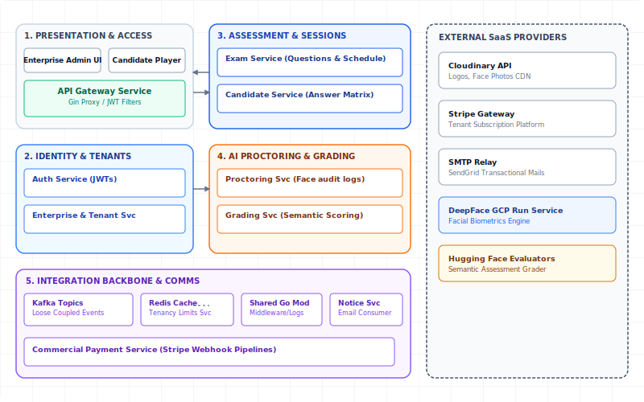

# Veritas Subsystems Decomposition

This document accompanies the standalone HTML subsystem decomposition figure. The embedded view presents the platform as cohesive logical subsystems, separating client access, identity and tenancy, assessment/session management, AI services, commercial workflows, shared infrastructure, and external providers.

## 1. Subsystems Diagrams

### 1.1 Global Subsystems Map

### 1.2 Identity and Tenant Subsystem

### 1.3 Assessment and Session Subsystem

### 1.4 Integration Subsystem

[Open the interactive subsystem decomposition HTML](./subsystems_decomposition.html)

## 2. Subsystem Breakdown

- **Presentation and access:** Admin, enterprise staff, and candidate web clients enter through the API Gateway.
- **Gateway and security:** The API Gateway centralizes reverse proxy routing, CORS, role checks, enrollment-token checks, rate limiting, and documentation access.
- **Identity and tenant management:** Auth manages login, refresh sessions, JWT issuance, and session revocation. Enterprise manages tenant onboarding, staff, lifecycle state, and policy data.
- **Assessment and candidate sessions:** Exam manages question banks, media, schedules, and publishing. Candidate manages enrollments, access redemption, exam sessions, answers, and submissions.
- **AI proctoring and grading:** Proctoring handles face verification, proctoring events, and cheating score aggregation. Grading handles automated scoring, result persistence, manual overrides, and audit logs.
- **Commercial and communications:** Payment owns plans, subscriptions, invoices, and Stripe webhook processing. Notification consumes Kafka events and sends transactional email through SMTP.
- **Integration layer:** Kafka provides asynchronous domain and consistency events, Redis supports gateway/proctoring runtime state, and the shared Go module provides reusable infrastructure packages.

## 3. Notes For Reports

Markdown renderers commonly block embedded HTML documents, so this page embeds exported SVG views directly for reliable preview. Open the HTML file for the interactive tabbed view and copy/export workflow.
