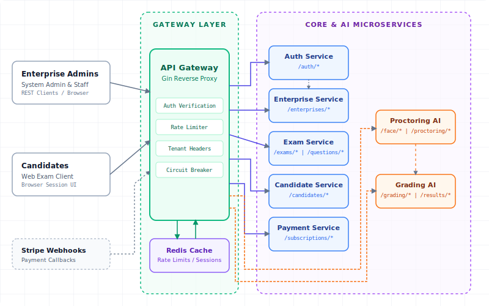
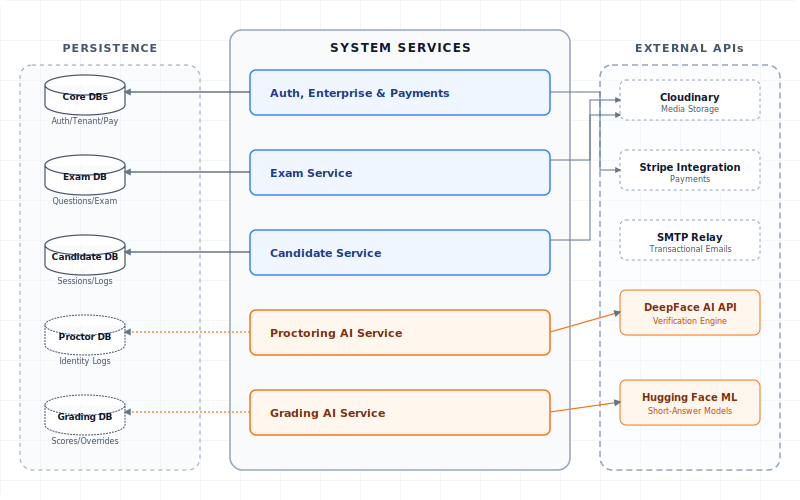

# Veritas System Architecture

This document accompanies the standalone HTML system architecture figure. The embedded view focuses on how Veritas combines synchronous HTTP routing with asynchronous Kafka event flows to keep service boundaries isolated while supporting real-time examination workflows.

## 1. System Architecture Diagrams

### 1.1 Edge and API Routing

### 1.2 Asynchronous Event Backbone

### 1.3 Persistence and External Providers

[Open the interactive system architecture HTML](./system_architecture.html)

## 2. Architecture Summary

Veritas uses a hybrid communication model:

- **Synchronous REST through the API Gateway:** Client requests are authenticated, authorized, rate-limited, and routed to the owning service.
- **Service-to-service HTTP:** Used when immediate data is required, such as tenant context lookup, exam package retrieval, candidate reference lookup, and subscription checks.
- **Kafka event backbone:** Used for domain events, notification triggers, and eventual consistency across service-owned databases.
- **Database-per-service ownership:** Each business service persists to its own logical PostgreSQL database and exposes data through APIs/events rather than cross-service database access.
- **External provider boundaries:** Stripe, Cloudinary, SMTP, DeepFace, and Hugging Face integrations remain behind the owning service that controls the workflow.

## 3. Main Runtime Flows

- **Authentication and tenant context:** Auth validates credentials and works with Enterprise data to issue scoped JWTs.
- **Exam authoring and enrollment:** Enterprise staff configure exams through Exam, then Candidate manages enrollment and session access.
- **Candidate exam execution:** Candidate sessions retrieve exam content from Exam and publish submission events for downstream workflows.
- **Proctoring:** Proctoring ingests candidate events and face checks, calls the DeepFace API, stores proctoring state, and publishes identity/cheating-score events.
- **Grading:** Grading consumes ready-for-grading events, invokes the Hugging Face evaluator for short-answer scoring, and persists results/audit logs.
- **Billing and notifications:** Payment processes Stripe workflows and emits subscription events. Notification consumes domain events and sends transactional emails.

## 4. Notes For Reports

Markdown renderers commonly block embedded HTML documents, so this page embeds exported SVG views directly for reliable preview. Open the HTML file for the interactive tabbed view and copy/export workflow.
